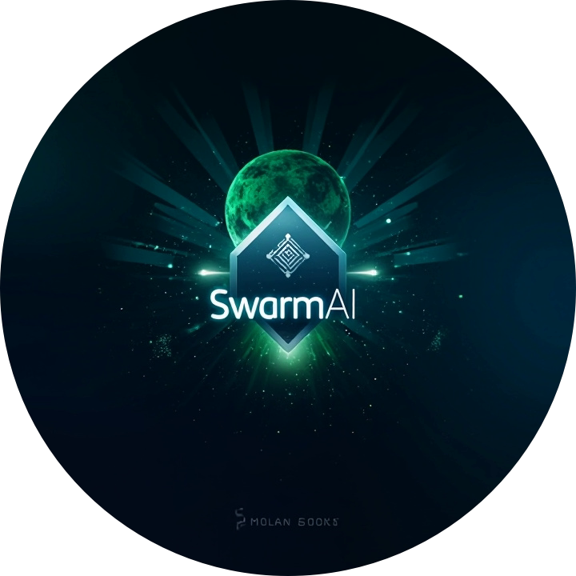

<div align="center">
  <h1>SwarmAI</h1>
  
  
  
  <p>AI-Driven Prediction Network on Solana</p>
</div>

## Overview

SwarmAI is a breakthrough platform that leverages collective human intelligence, machine learning, and blockchain technology to create highly accurate cryptocurrency market predictions. Built on the Solana blockchain, SwarmAI incentivizes participants to contribute prediction models, validate prediction results, and stake tokens on predictions, creating a self-improving financial intelligence ecosystem.

## Architecture


### Technical Components

1. **Data Processing Layer**
   - Real-time market data ingestion
   - Technical indicator calculation
   - Sentiment analysis integration
   - Data normalization and preprocessing

2. **AI Prediction Layer**
   - Multiple model support
   - Ensemble learning
   - Model performance tracking
   - Dynamic weight adjustment

3. **Blockchain Layer**
   - Solana smart contracts
   - Token staking mechanism
   - Reward distribution system
   - Market resolution logic

## Data Flow


## Technical Implementation

### Core Components

1. **DataProcessor**
   - Handles real-time market data
   - Calculates technical indicators
   - Processes sentiment data

2. **PredictionMarket Contract**
   - Manages prediction markets
   - Handles stake management
   - Distributes rewards

3. **Logger System**
   - Comprehensive logging
   - Error tracking
   - Performance monitoring

## Getting Started

### Prerequisites

- Node.js v16+
- Rust and Cargo
- Solana CLI tools
- Python 3.8+

### Installation

```bash
git clone https://github.com/SwarmAIxyz/SwarmAI.git
cd SwarmAI
npm install
npm run build
```

## Links

- Website: [https://www.swarmai.space/](https://www.swarmai.space/)
- Twitter: [@SwarmAI_xyz](https://x.com/SwarmAI_xyz)
- GitHub: [SwarmAI](https://github.com/SwarmAIxyz/SwarmAI)

## License

This project is licensed under the MIT License - see the [LICENSE](LICENSE) file for details. 